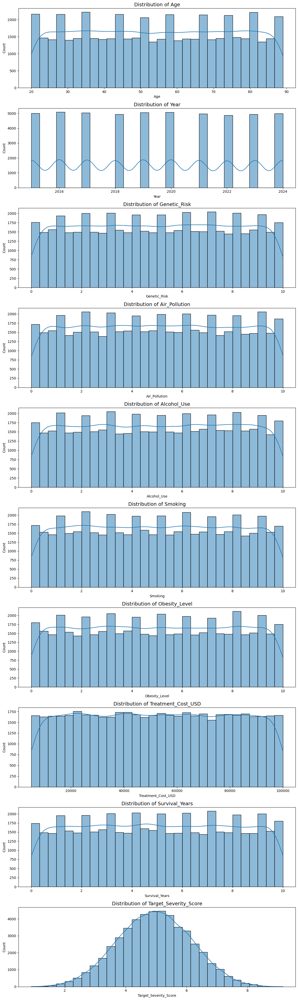

# Laporan Proyek Machine Learning Terapan - Felix Rafael
## Project Domain
Menurut **[Hanahan & Weinberg (2011)](https://doi.org/10.1016/j.cell.2011.02.013)**, Kanker merupakan suatu penyakit yang ditandai oleh _proliferasi_ sel abnormal secara tidak terkendali yang dapat menyerang jaringan di sekitarnya dan menyebar ke organ tubuh lain melalui proses _metastasis_. Secara biologis, kanker terjadi karena mutasi genetik yang memengaruhi jalur pengaturan siklus sel, _apoptosis_, dan mekanisme perbaikan DNA, yang menyebabkan sel kehilangan kemampuan untuk mengatur pertumbuhannya secara normal. Saat ini, kanker tetap menjadi tantangan kesehatan global yang signifikan, dengan dampak yang luas terhadap individu dan sistem kesehatan masyarakat. 

Menurut laporan **[International Agency for Research on Cancer (2020) ](https://doi.org/10.1016/j.cell.2011.02.013)**, terdapat hampir 20 juta kasus kanker baru dan sekitar 10 juta kematian akibat kanker di seluruh dunia pada tahun tersebut. Kanker paru-paru, payudara, dan kolorektal merupakan jenis yang paling umum, dengan kanker paru-paru menjadi penyebab utama kematian akibat kanker. Proyeksi yang ditunjukkan dari laporan **[ International Agency for Research on Cancer dan American Cancer Society  (2024) ](https://www.iarc.who.int/news-events/new-report-on-global-cancer-burden-in-2022-by-world-region-and-human-development-level)** menunjukkan bahwa pada tahun 2050, jumlah kasus kanker baru tahunan dapat mencapai 35 juta, meningkat 77% dari angka tahun 2022.

Deteksi dini kanker sangat penting dalam meningkatkan hasil pengobatan dan kelangsungan hidup pasien. Namun, menurut penelitian yang dilakukan oleh **[Crosby et al. (2022) ](https://www.science.org/doi/10.1126/science.aay9040)** sekitar 50% kasus kanker didiagnosis pada stadium lanjut, yang secara signifikan mengurangi efektivitas pengobatan dan peluang kesembuhan. Studi oleh **[Cancer Research UK (2023) ](https://www.cancerresearchuk.org/about-cancer/spot-cancer-early/why-is-early-diagnosis-important)** menekankan bahwa diagnosis kanker pada tahap awal meningkatkan kemungkinan pengobatan yang berhasil dan kelangsungan hidup pasien. Oleh karena itu, strategi untuk meningkatkan deteksi dini sangat penting dalam upaya mengurangi beban kanker secara global.

Dalam konteks ini, pendekatan berbasis teknologi, khususnya _Machine Learning_ (ML), menawarkan potensi besar dalam meningkatkan deteksi dan prediksi keparahan kanker. ML dapat menganalisis data klinis dan lingkungan pasien untuk mengidentifikasi pola yang mungkin tidak terlihat oleh metode konvensional. Studi oleh **[Zhou dan Rhrissorrakrai (2024)](https://doi.org/10.48550/arXiv.2410.22387)** menunjukkan bahwa ML dapat digunakan untuk menemukan _biomarker multi-omik_ yang berkaitan dengan keparahan kanker prostat, yang dapat membantu dalam penilaian dan pengobatan pasien .

Proyek ini bertujuan untuk mengembangkan model prediksi keparahan kanker menggunakan beberapa algoritma Machine Learning. Dengan memanfaatkan data dari berbagai faktor genetik dan lingkungan, model diharapkan dapat memberikan prediksi yang akurat mengenai tingkat keparahan kanker pada pasien. Implementasi model dapat membantu dalam pengambilan keputusan klinis, perencanaan pengobatan, dan pada akhirnya, meningkatkan hasil kesehatan pasien secara keseluruhan.

## Business Understanding
### Problem Statements
- Tingkat keparahan kanker yang bervariasi antar pasien membuat diagnosis dan penanganan menjadi kompleks, ditambah kurangnya alat bantu berbasis kecerdasan buatan yang dapat memberikan prediksi tingkat keparahan kanker kepada tenaga medis atau pasien.
- Belum adanya sistem prediksi terintegrasi yang menggabungkan faktor genetik, gaya hidup, dan lingkungan secara bersamaan dalam memperkirakan tingkat keparahan kanker. 
- Model _baseline_ sederhana yang belum mampu memberikan akurasi prediksi yang tinggi dalam konteks regresi medis. 

### Goals
- Mengembangkan model _Machine Learning_ berbasis regresi untuk memprediksi tingkat keparahan kanker dengan akurasi tinggi.
- Mengintegrasikan berbagai fitur dari data genetik, gaya hidup, dan lingkungan guna meningkatkan akurasi dan generalisasi model.
- Melakukan eksperimen dengan beberapa algoritma tingkat lanjut untuk menemukan model terbaik dalam memprediksi skor keparahan kanker, serta memvisualisasikan hasil evaluasi model untuk analisis residual yang lebih dalam.

### Solution Statement
- Mengimplementasikan model regresi berbasis _Machine Learning_ tingkat lanjut, seperti _Random Forest Regressor_, _XGBoost Regressor_, dan _LightGBM Regressor_ untuk memprediksi tingkat keparahan kanker berdasarkan integrasi data dari faktor genetik, gaya hidup, dan lingkungan dengan akurasi yang tinggi.
- Mengintegrasikan berbagai fitur penting dari domain genetik, gaya hidup, dan lingkungan dengan analisis korelasi berbasis statistik untuk memastikan input yang diberikan ke model relevan dan berkualitas tinggi.
- Mengoptimalkan performa model dengan _hyperparameter tuning_ pada algoritma yang dipilih dengan menggunakan teknik _RandomizedSearchCV_, guna meningkatkan akurasi prediksi dan mengurangi _error_. Dilakukan juga visualisasi dan evaluasi mendalam, termasuk _plotting_ residual, p_redicted vs actual scores_, dan distribusi _error_ guna memahami perilaku model dan mengidentifikasi bias atau pola ketidaksesuaian dalam hasil prediksi.

## Data Understanding
Dataset yang digunakan dalam proyek ini diperoleh dari platform Kaggle dengan judul **`Global Cancer Patients (2015–2024)`**. Dataset ini berisi data pasien kanker dari berbagai negara dan mencakup sejumlah faktor penting seperti data demografis, genetika, gaya hidup, serta kondisi lingkungan pasien. Tujuan dari penggunaan dataset ini adalah untuk membangun model regresi yang dapat memprediksi tingkat keparahan kanker berdasarkan kombinasi fitur-fitur tersebut. 

Dataset ini terdiri dari 50.000 baris data pasien dan 15 kolom fitur, disajikan dalam format tabular (CSV). Seluruh data telah melalui proses pembersihan sehingga tidak terdapat _missing values_ maupun data duplikat, menjadikannya siap untuk dianalisis dan digunakan dalam pemodelan _machine learning_.

Link Dataset: https://www.kaggle.com/datasets/zahidmughal2343/global-cancer-patients-2015-2024

### Variabel-variabel pada dataset Global Cancer Patients (2015–2024) sebagai berikut:
- **`Patient_ID`** : 	ID unik untuk mengidentifikasi setiap pasien. Tidak digunakan dalam pemodelan.
- **`Age`** :	Usia pasien pada saat data dikumpulkan (dalam tahun).
- **`Gender`** : Jenis kelamin pasien (Male, Female, Other).
- **`Country_Region`** : Negara atau wilayah asal pasien.
- **`Year`** : Tahun pencatatan data pasien, antara 2015 hingga 2024.
- **`Genetic_Risk`** : Tingkat risiko genetik terhadap kanker, dalam skala 0–10.
- **`Air_Pollution`** : 	Indeks paparan polusi udara di lingkungan pasien (semakin tinggi, semakin buruk), dalam skala 0-10.
- **`Alcohol_Use`** : Tingkat konsumsi alkohol pasien, dalam skala kuantitatif 0-10.
- **`Smoking`** : Tingkat kebiasaan merokok pasien, dalam skala 0–10.
- **`Obesity_Level`** : Tingkat obesitas pasien, dalam skala 0-10.
- **`Cancer_Type`** : 	Jenis kanker yang diderita oleh pasien (contoh: Lung, Breast, dll).
- **`Cancer_Stage`** : Tahapan kanker (contoh: Stage I, Stage II, Stage III, Stage IV).
- **`Treatment_Cost_USD`** :
- **``** : 	Perkiraan total biaya pengobatan yang telah dikeluarkan (dalam USD).
- **`Survival_Years`** : 	Estimasi waktu bertahan hidup pasien setelah diagnosis (dalam tahun).
- **`Target_Severity_Score`**: 	Skor target yang menunjukkan tingkat keparahan kanker (nilai kontinu). Merupakan variabel target (label) dalam prediksi.

### Visualisasi Distribusi Data Numerik

Distribusi variabel numerik dalam dataset ini memberikan gambaran awal yang penting untuk memahami karakteristik data yang akan digunakan dalam pemodelan. Variabel _Age_ menunjukkan distribusi yang relatif merata antara rentang usia 20 hingga 90 tahun, yang mengindikasikan bahwa dataset ini mencakup pasien dari berbagai kelompok usia tanpa dominasi signifikan pada kelompok tertentu. Distribusi _Year_ sebagai penanda waktu pencatatan data tampak merata antara tahun 2015 hingga 2024, menandakan bahwa data dikumpulkan secara konsisten selama rentang waktu satu dekade.

Pada variabel _Genetic_Risk_, _Air_Pollution_, _Alcohol_Use_, _Smoking_, dan _Obesity_Level_, distribusi tampak menyebar merata dari nilai 0 hingga 10. Ini menunjukkan bahwa tingkat risiko genetik, paparan polusi udara, konsumsi alkohol, kebiasaan merokok, serta tingkat obesitas bervariasi secara signifikan antar pasien, tanpa adanya _outlier_ yang ekstrem. Hal ini penting karena menunjukkan keragaman yang cukup pada faktor risiko yang akan dianalisis terhadap tingkat keparahan kanker.

Sementara itu, _Treatment_Cost_USD_ atau biaya pengobatan memperlihatkan sebaran yang cenderung merata dari angka 0 hingga mendekati 100.000 USD. Ini merefleksikan variasi yang tinggi dalam pembiayaan medis pasien, kemungkinan bergantung pada jenis kanker, stadium, dan lokasi geografis. Variabel _Survival_Years_, yang menunjukkan estimasi tahun bertahan hidup setelah diagnosis, juga tersebar merata antara 0 hingga 10 tahun, mencerminkan keberagaman prognosis dari masing-masing pasien.

Yang paling menarik adalah distribusi target atau label prediksi, yaitu Target_Severity_Score. Variabel ini memiliki distribusi menyerupai kurva normal (distribusi Gaussian), dengan sebagian besar pasien memiliki skor keparahan di sekitar nilai tengah (mean). Distribusi ini sangat ideal untuk masalah regresi karena dapat membantu model untuk belajar secara lebih stabil dan akurat terhadap variasi tingkat keparahan kanker berdasarkan fitur-fitur yang tersedia.
